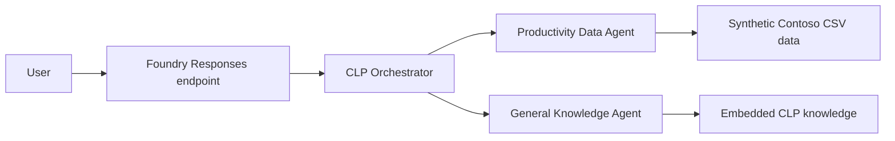

# CLP Multi-Agent Hosted Agent

This repository demonstrates a container-hosted Microsoft Foundry agent for the fictional Contoso Labour Productivity (CLP) system. A top-level orchestrator routes each request to one of two specialist agents:

- `ProductivityDataAgent` answers questions about required hours, actual hours, productivity percentages, departments, job categories, and date ranges.
- `GeneralKnowledgeAgent` explains CLP terminology and productivity calculations.

The implementation uses .NET 10, Microsoft Agent Framework, the Foundry Responses protocol, managed identity, and `DefaultAzureCredential`.

## Data Safety

All CSV files under `src/ClpHostedAgent/Data/` contain synthetic Contoso hospital data. They do not contain customer records or production identifiers. The productivity data is deterministic demonstration data covering 32 departments and 124,656 records from 2026-01-01 through 2027-09-15.

The CSV-backed tools simulate integrations such as a Fabric Data Agent or retrieval over CLP documentation. They are not live production integrations.

## Architecture



Foundry hosts the Docker image described by `src/ClpHostedAgent/Dockerfile`. The root `azure.yaml` defines the hosted-agent runtime contract, while `src/ClpHostedAgent/agent.manifest.yaml` provides template metadata and the `gpt-5.2` model requirement.

## Prerequisites

- .NET SDK 10
- Docker
- Azure Developer CLI (`azd`) 1.29 or later
- Terraform 1.4 or later for the currently selected infrastructure path
- `azure.ai.agents` and `microsoft.foundry` azd extensions
- Access to an Azure subscription and a Microsoft Foundry-supported region
- Permission to create resources and role assignments

Confirm the local tools and authenticate:

```powershell
dotnet --version
docker --version
azd version
terraform version
azd extension list
azd auth login
```

## Build

Run commands from the repository root:

```powershell
dotnet restore .\src\ClpHostedAgent\ClpHostedAgent.csproj
dotnet build .\src\ClpHostedAgent\ClpHostedAgent.csproj -c Release
docker build -t clp-hosted-agent:local .\src\ClpHostedAgent
```

## Run Locally

The agent requires a Foundry project endpoint and model deployment. Store these in the active azd environment rather than committing them:

```powershell
azd env new clp-local
azd env set AZURE_AI_PROJECT_ENDPOINT "https://<account>.services.ai.azure.com/api/projects/<project>"
azd env set FOUNDRY_PROJECT_ENDPOINT "https://<account>.services.ai.azure.com/api/projects/<project>"
azd env set AZURE_AI_MODEL_DEPLOYMENT_NAME "<model-deployment-name>"
```

Start the local host and invoke it from a second terminal:

```powershell
azd ai agent run --no-client
azd ai agent invoke --local "What is productivity percent?"
azd ai agent invoke --local "Compare Emergency Services productivity with Critical Care."
```

The host exposes the Responses endpoint on port 8088. You can also use Foundry Toolkit's Agent Inspector while the host is running.

## Infrastructure Providers

The repository preserves equivalent infrastructure implementations:

| Path | Provider | Intended use |
|------|----------|--------------|
| `infra-terraform/` | Terraform with AzureRM and AzAPI | Currently selected in `azure.yaml` |
| `infra/` | Bicep | Alternative Microsoft sample path |

Provider selection is a project adoption decision, not a runtime toggle. Do not alternate providers for the same azd environment because Bicep deployment history and Terraform state are independent.

The Terraform implementation uses AzureRM for stable resources and AzAPI for Foundry resources whose ARM APIs are preview-only. It also:

- creates the public `Agents` capability host separately from the ACR;
- assigns the deployer the stable `Foundry User` role ID rather than resolving an obsolete role display name;
- grants the project identity `AcrPull` and the deployer container build permissions;
- emits the Foundry project, ACR, and Application Insights values expected by azd; and
- recognizes its generated ACR and Application Insights outputs as stack-owned on later runs, preventing them from being reclassified as external resources and proposed for destruction.

Commit `infra-terraform/.terraform.lock.hcl`. Never commit `.terraform/`, state files, plans, generated azd environment files, or credential-bearing variable files. Configure a secured remote Azure Storage backend according to organizational standards before team or production use.

Validate Terraform without deploying:

```powershell
terraform -chdir=infra-terraform fmt -check -recursive
terraform -chdir=infra-terraform init -backend=false
terraform -chdir=infra-terraform validate
```

To switch a new branch to Bicep, change the root `azure.yaml` before creating its first azd environment:

```yaml
infra:
    provider: bicep
    path: ./infra
```

## Provision With Terraform

Create a fresh azd environment and set both hosted-agent switches. `ENABLE_HOSTED_AGENTS` creates the ACR path; `ENABLE_CAPABILITY_HOST` creates the Foundry hosting capability required to register and run hosted agents.

```powershell
azd env new <environment-name>
azd env set AZURE_SUBSCRIPTION_ID "<subscription-id>"
azd env set AZURE_LOCATION "<supported-region>"
azd env set AZURE_AI_DEPLOYMENTS_LOCATION "<supported-region>"
azd env set ENABLE_HOSTED_AGENTS true
azd env set ENABLE_CAPABILITY_HOST true
azd provision --no-prompt
```

`azd provision` creates infrastructure only. A successful provision does **not** create an entry on the Foundry Agents page.

Review any subsequent Terraform plan before applying it. It must not propose replacing or destroying the stack-owned ACR, Application Insights, or Log Analytics resources merely because their outputs have been written back into the azd environment.

## Deploy The Agent

Run the application deployment after provisioning:

```powershell
azd deploy clp-multi-agent-orchestrator --no-prompt --environment <environment-name>
```

This distinct step builds the production container, pushes it to ACR, and registers an immutable hosted-agent version in Foundry. The agent becomes visible in the Foundry Agents page only after this command succeeds.

Verify that the registered version is active and has a Responses endpoint:

```powershell
azd ai agent show clp-multi-agent-orchestrator --environment <environment-name> --output json
```

Expected indicators include:

```json
{
  "status": "active",
  "agent_endpoints": {
    "responses": "https://<account>.services.ai.azure.com/api/projects/<project>/agents/clp-multi-agent-orchestrator/endpoint/protocols/openai/responses?api-version=v1"
  }
}
```

Run one remote smoke test:

```powershell
azd ai agent invoke clp-multi-agent-orchestrator "Which department has the highest productivity percentage? Give a concise answer." --environment <environment-name>
```

## Troubleshooting Deployment

- Empty Foundry Agents page: run `azd ai agent show ...`. If it reports that the agent name cannot be resolved and says to deploy first, run `azd deploy`; do not reprovision Terraform.
- No repository in ACR: the container deployment has not pushed an image yet. Run `azd deploy`.
- Capability-host error: confirm both environment flags are `true`, then run `azd provision` and verify that the `agents` capability host reaches `Succeeded` before deploying.
- Role lookup failure: the Terraform configuration intentionally uses the stable `Foundry User` role definition ID `53ca6127-db72-4b80-b1b0-d745d6d5456d`.
- ACR authorization delay: role assignments can take several minutes to propagate. Retry `azd deploy` after propagation rather than recreating resources.
- Unexpected Terraform destroys: stop and inspect the environment inputs and `infra-terraform/locals.tf`; do not apply a plan that reclassifies generated ACR or monitoring resources as external.

## Observability

Terraform creates a workspace-based Application Insights resource and Log Analytics workspace by default. The Foundry project receives an Application Insights connection, and the project identity is granted read access.

Inspect the active agent and stream hosted-agent logs:

```powershell
azd ai agent show clp-multi-agent-orchestrator --environment <environment-name> --output json
azd ai agent monitor --follow --environment <environment-name>
```

Remote invocations return a session ID and trace ID. Use the trace ID to correlate a request in Foundry tracing and Application Insights. Validate trace ingestion, retention, alerting, dashboards, and access controls before treating this demonstration configuration as production observability.

## Example Questions

- What is productivity percent and how is it calculated?
- What date range is available?
- List the available departments.
- Show productivity for Emergency Services in January 2026.
- Compare RN productivity across Critical Care departments.

## Important Limitations

- The project is a demonstration, not a production clinical or staffing decision system.
- The data and knowledge tools are local simulations.
- Several Foundry and Agent Framework dependencies use preview APIs or packages.
- Validate model availability, quota, RBAC, network policy, remote state, monitoring, and organizational security controls before customer deployment.